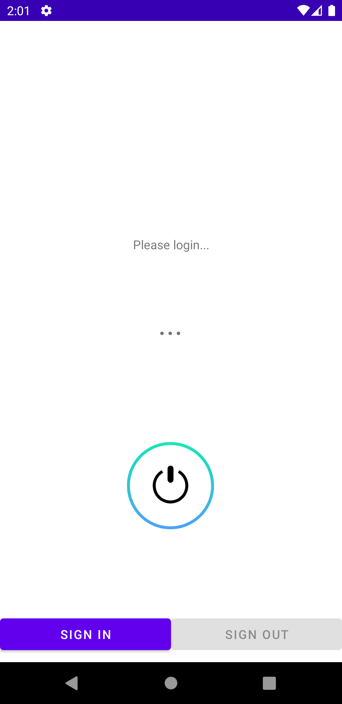
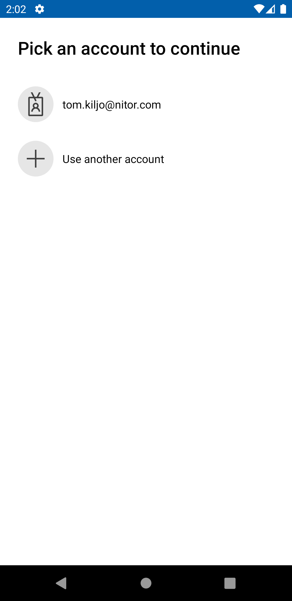
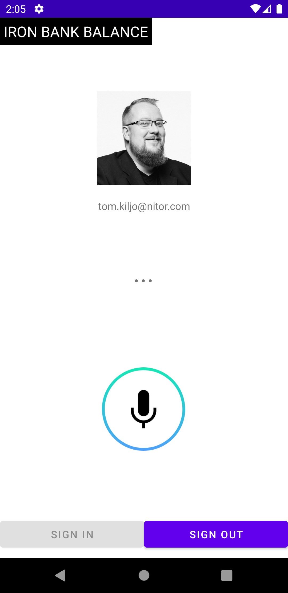
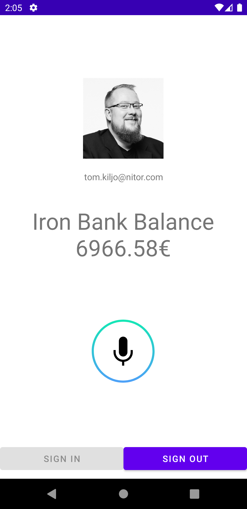

# Nitor - Multi Modal Core Week demo app

This repository contains an example app that enables:
1. login with your Nitor AD account
2. use of Speechly to issue and interprete voice commands
3. query personal Iron Bank balance by saying 'What is my iron bank balance' 

The demo app utilizes the following libraries and SDKs:
- [Speechly](https://www.speechly.com/?utm_source=github&utm_medium=android-example&utm_campaign=text) Android client
- [Microsoft Authentication Library for Android](https://github.com/AzureAD/microsoft-authentication-library-for-android) MSAL
- [Microsoft Graph SDK](https://github.com/microsoftgraph/msgraph-sdk-java)

## Prerequicites

Due to company policies in order to use MSAL for authentication/authorization on Android you are required to install the Intune Company Portal app and register your device. This prerequicite includes Android emulators.

On actual hardware it is best to install the app from [Play Store](https://play.google.com/store/apps/details?id=com.microsoft.windowsintune.companyportal&hl=en&gl=US).

On emulator it is easiest to download the APK directly from [Microsoft website](https://www.microsoft.com/en-us/download/details.aspx?id=49140). This allows you to setup the app without using Play Store capable emulator image and additionally logging in with your Google account.

⚠️ Never ever install the app from any source other than Play Store or Microsoft website ⚠️

## Run the demo app

Before running the project on an emulator or a real device make sure to setup the required Intune Company Portal app. 

To get the demo app running quickly we've pre-created:
- Speechly application with a very simple setup (see `demo.sal`)
- Azure AD application in Nitor tenant with minimal setup from you

1. Clone the `multimodal-core-week-demo` repository.
2. Open the project in Android Studio.
3. Generate a development Signature Hash from your Android Studio IDE generated [debug certificate](https://developer.android.com/studio/publish/app-signing#debug-mode) and resolve other important variables by running `debug_signature_hash.sh` from the root of the project. The output should be somewhat similar:
   ```
   $ ./debug_signature_hash.sh

   Debug signature hash: H40qc85s/EyxwnrXGw8DJW3F/ro=
   Project package: com.nitor.multimodalcoreweekdemo
   Redirect uri: msauth://com.nitor.multimodalcoreweekdemo/H40qc85s%2FEyxwnrXGw8DJW3F%2Fro%3D
   ```  
4. Give the output to Core Week Azure advisors so they can configure the authentication for the Azure AD app. If you're feeling adventurous you can do it yourself and event create a new Azure AD app by following these [instructions](https://docs.microsoft.com/en-us/azure/active-directory/develop/tutorial-v2-android).
5. In `./app/src/main/AndroidManifest.xml` line `36` replace the `android:path` property with your debug signature hash from the previous command. Note that the forward slash prefix is required.
6. In `./app/src/main/res/raw/auth_config_single_account.json` replace `redirect_uri` with your value from the previous command.
7. Build and run the project on an emulator or a real device.

## Usage

Login to your Nitor AD account by clicking the **Sign-in** button. Accept your consent for the asked permissions. After a successful login you should see your principal name and profile picture.


 

Press the Speechly button and try out the following phrases:
- What is my iron bank balance
- Iron bank balance



Both phrases activate the same action which utilizing Microsoft Graph API attempts to retrieve your current Iron Bank balance from the Excel sheet in the company OneDrive.

 

## About Speechly

Speechly is a developer tool for building real-time multimodal voice user interfaces. It enables developers and designers to enhance their current touch user interface with voice functionalities for better user experience. Speechly key features:

#### Speechly key features

- Fully streaming API
- Multi modal from the ground up
- Easy to configure for any use case
- Fast to integrate to any touch screen application
- Supports natural corrections such as "Show me red – i mean blue t-shirts"
- Real time visual feedback encourages users to go on with their voice